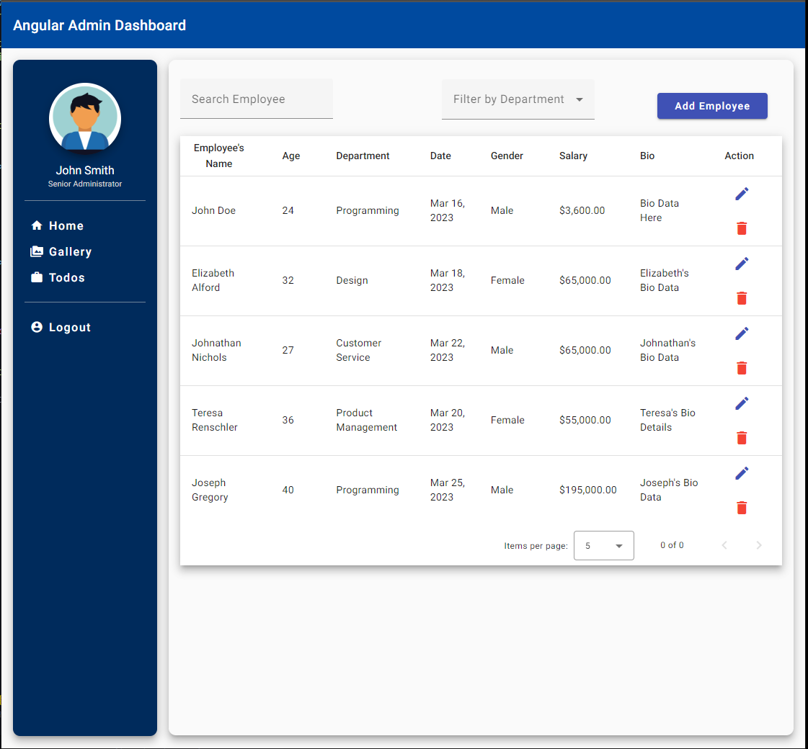
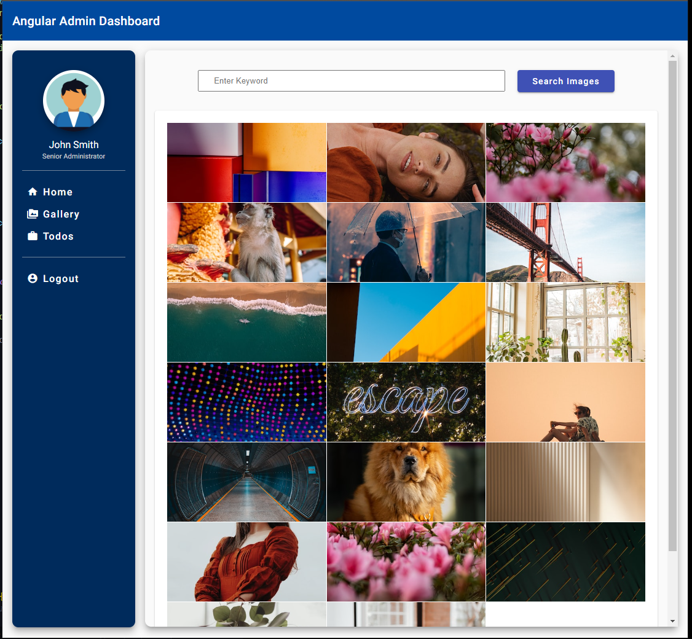
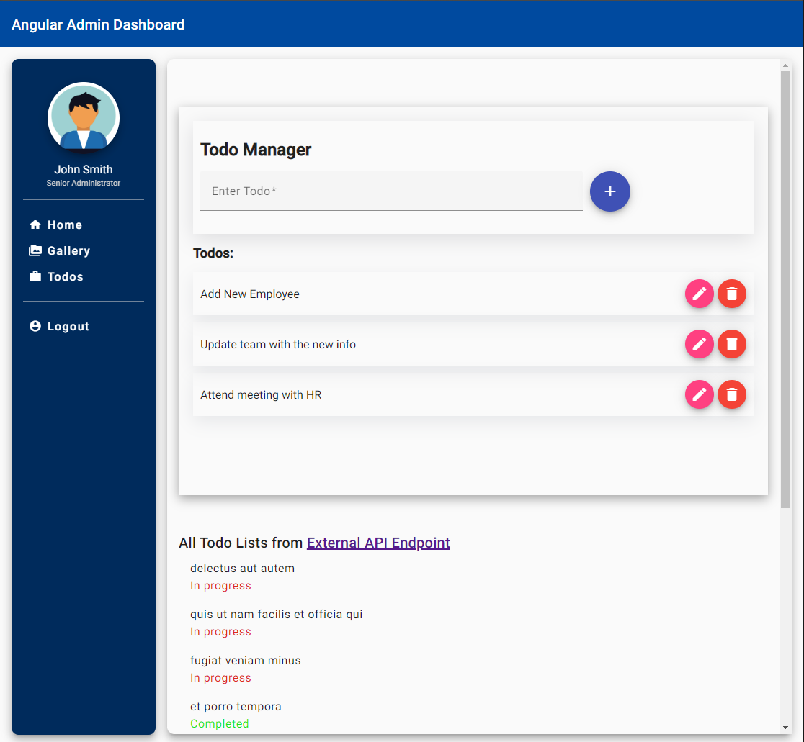

# Admin Dashboard

## Introduction
This is an Angular-based web application that serves as an admin dashboard, comprising three separate modules: an employee management system, a gallery application that fetches images using the Unsplash API, and a todo app.

The project uses Angular, Angular Material, and JSON server to provide a seamless user experience, with a modern interface and advanced features.

## Preview



## Employee Management System
The Employee Management System module provides functionality for managing employee data, including adding, editing, and deleting employee records. It uses Angular Material components to create a modern, responsive interface.
Additionally, this module provides pagination, filter by name, and sort by role features. Users can choose the number of records displayed per page, search for employees by their name, and sort employees based on their role.


## Gallery
The Gallery App module fetches images from the Unsplash API and displays them in a responsive grid. It provides functionality for searching for specific images based on keywords.


## Todo App 
The Todo App module allows users to create, edit, and delete to-do items. It provides a user-friendly interface with Angular Material components. It also displays a list of fetched to-dos from a REST API (limited to 10). The status of the fetched to-dos is tracked by a fetch button which can be used to re-fetch the list after a certain time interval. This functionality is built with RXJS.

## Installation
To install and run this project, you will need to have the following software installed on your computer:

- Node.js
- Angular CLI

Once you have the required software installed, follow these steps to get started:

1. Clone the repository on your local machine using the following command:

```
git clone https://github.com/Omolara5861/admin-dashboard.git
```

2. Navigate to project directory and install the necessary dependencies using the following command:

```
cd admin-dashboard && npm i
```

## Usage
### Running the Project

To start the project, run the following command in the client directory:
```
ng serve
```
This will start the project on http://localhost:4200/.

## JSON Server
The project uses JSON server to provide a mock REST API for the Employee Management System and To-do App modules.

To run the server:

1. Clone the repository on your local machine using another terminal:

```
git clone https://github.com/Omolara5861/admin-dashboard-server.git
```

1. Navigate to project directory, install the necessary dependencies, and start the server using the following command:

```
cd admin-dashboard-server && npm i && npm start
```
This would start the server on port 3000 and can be accessed at http://localhost:3000.

## Development Stack
This project was built with VS Code using:
* __Frontend__<br/>
      
      
      

* __Backend__<br/>
        


## Project To-do

- [ ] To create login functionality
- [ ] To create functionality for marking to-do as completed

## License
This project is released under the
[MIT license](https://opensource.org/licenses/MIT).
Please see the [LICENSE file](LICENSE) for more information.

> You can do whatever you want as long as you include the original copyright and
> license notice in any copy of the project/source.

## Contributing
If you would like to contribute to this project, please open an issue or submit a pull request on the project's GitHub repo. Contributions are welcome and appreciated.

Admin Dashboard
\
*Copyright &copy; 2023 LaraDev <debbiegterra@gmail.com>. All right reserved.*
